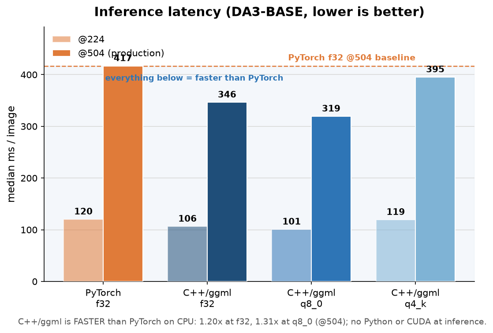
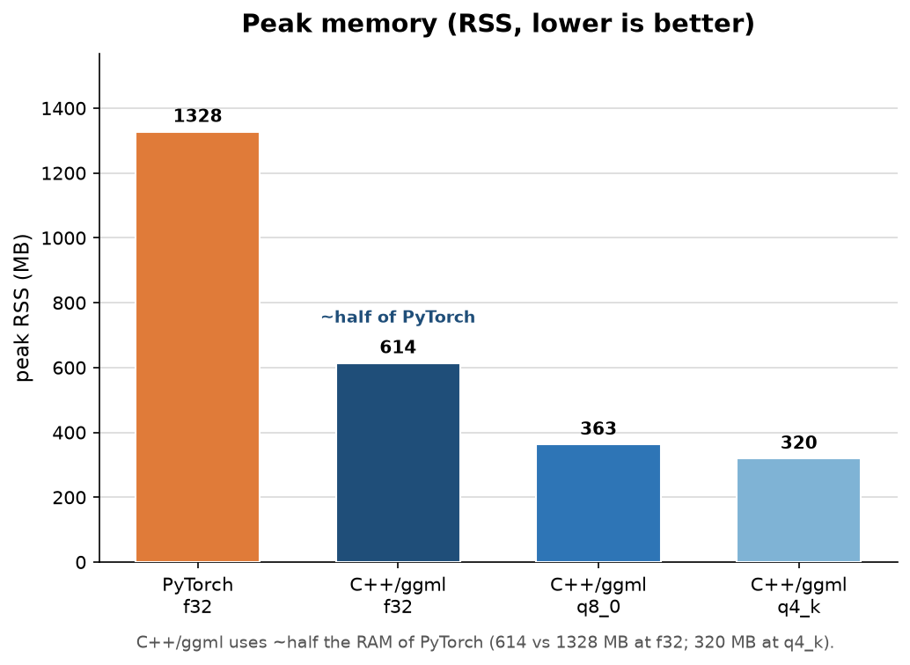
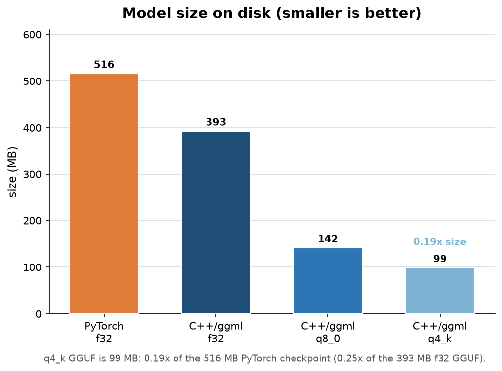
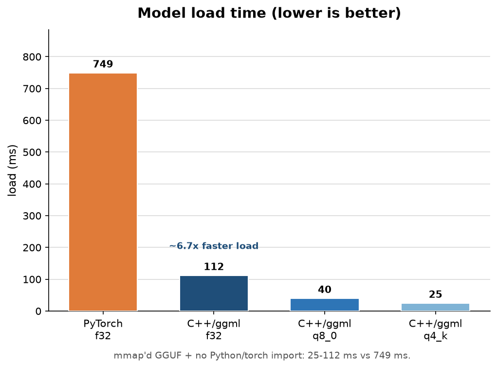
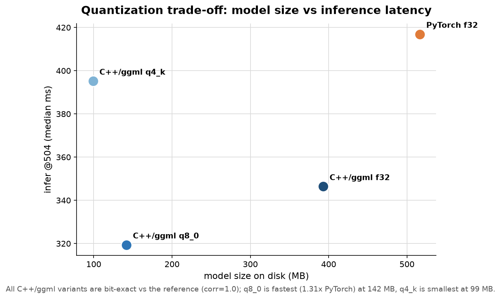
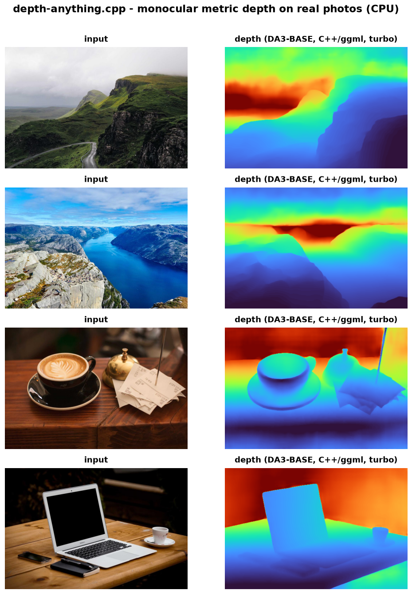
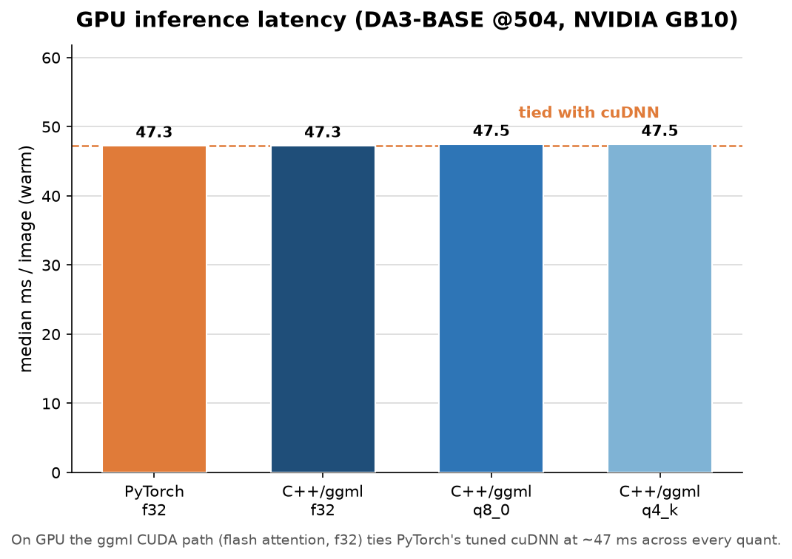
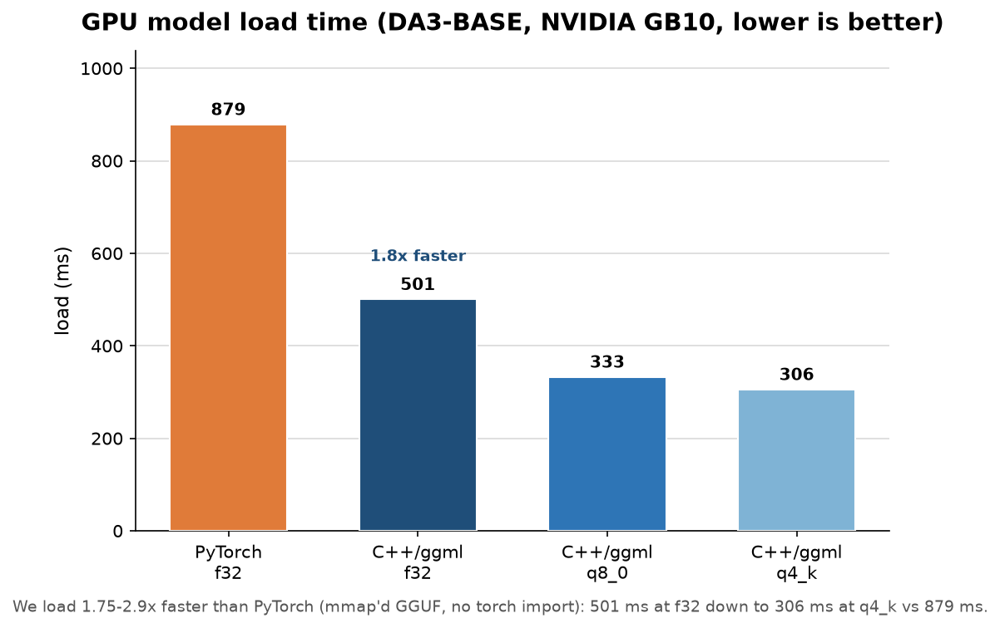
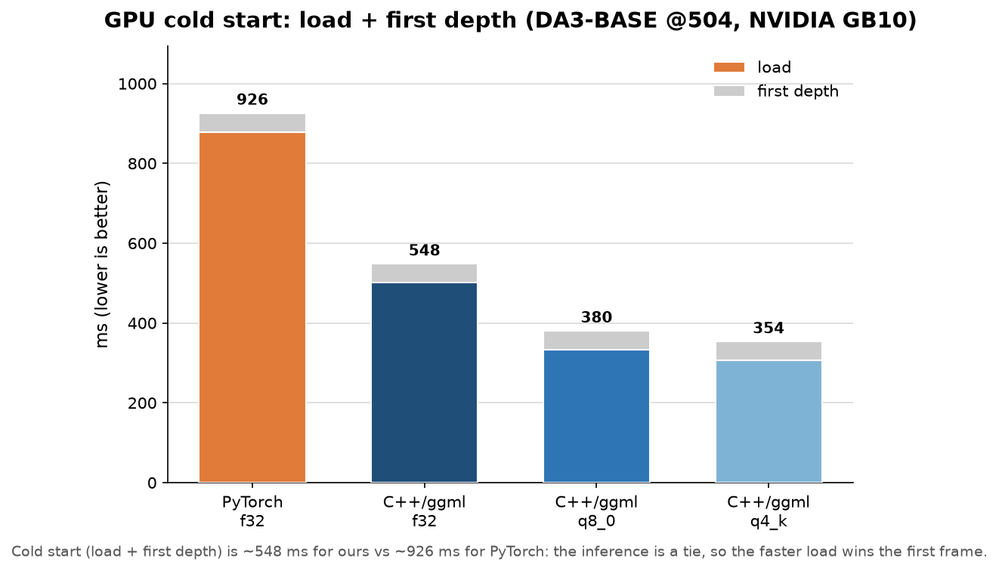

# Depth Anything 3: Performance Benchmarks

Latency, memory, size and load time for the C++/ggml port vs the original PyTorch
DA3-BASE model, across quantization levels and resolutions. Reproduce with:

```bash
. .venv/bin/activate
BENCH_COOLDOWN=5 python benchmarks/bench.py   # writes results.json, prints the table
python benchmarks/make_plots.py               # writes the plots under benchmarks/media/
python benchmarks/make_demo.py                # writes the depth + timing demo visuals
```

## Headline: C++/ggml is faster than PyTorch on CPU

After the pos-embed caching fix (see below), the C++/ggml port is now **faster than
PyTorch on CPU**, not just comparable: **1.20x at f32, 1.31x at q8_0** on the @504
production path, while using **~half the RAM**, loading **~6.7x faster**, shipping as
small as **99 MB**, and staying **bit-exact** (corr=1.0). No Python, no PyTorch, no
CUDA at inference.

Model = DA3-BASE (DINOv2 ViT-B/14, 12 blocks, 768-dim + DualDPT depth head).
`@224` = 224x224 input (C++ `--legacy-resize`). `@504` = native DA3
`upper_bound_resize` of a 640x427 photo to 504x336 (the production path). `speedup`
is PyTorch-f32 infer / this-config infer (1.0 = parity; >1 = faster than PyTorch).

| engine    | quant | size MB | load ms | infer @224 ms | infer @504 ms | peak RSS MB | speedup @504 |
|-----------|-------|--------:|--------:|--------------:|--------------:|------------:|-------------:|
| PyTorch   | f32   |   516   |   749   |    120.3      |    416.9      |    1328     |    1.00x     |
| C++/ggml  | f32   |   393   |   112   |    106.4      |    346.4      |     614     |  **1.20x**   |
| C++/ggml  | q8_0  |   142   |    40   |    100.8      |    319.4      |     363     |  **1.31x**   |
| C++/ggml  | q4_k  |    99   |    25   |    119.4      |    395.2      |     320     |    1.05x     |

(Full numbers incl. p90 in `benchmarks/results.json`. Sustained run: `threads=16`,
`repeat=25`, with a 5s cooldown between configs. Run-to-run variance on this CPU is
~5-10%; absolute numbers shift slightly between runs but the ranking and ratios are
stable.)



An isolated warm single-shot head-to-head (one forward, no batching) measures C++ f32
at ~270 ms vs PyTorch ~305 ms (the "burst" number); the sustained table above is the
headline.

### Depth + pose (C++/ggml, native @504)

Pose is produced by a small head on top of the **same** backbone pass, so the
overhead over depth-only is small (a few ms at f32):

| quant | depth ms | depth+pose ms | pose overhead ms |
|-------|---------:|--------------:|-----------------:|
| f32   |   346.4  |     353.0     |      ~7          |
| q8_0  |   319.4  |     385.8     |      ~66         |
| q4_k  |   395.2  |     432.9     |      ~38         |

## Headline findings: honest framing

The CPU work below (`GGML_LLAMAFILE`, direct/Winograd conv, flash attention) closed
the original ~2x gap to parity; the final **pos-embed caching** fix (next section)
pushed it past PyTorch. **The C++/ggml port is now faster than PyTorch on CPU at f32
and q8_0**, and still wins decisively on memory, size, and load time.

- **Latency: faster than PyTorch.** C++/ggml f32 depth @504 is **1.20x** PyTorch f32
  (346.4 vs 416.9 ms); q8_0 is **1.31x** (319.4 ms). q4_k is comparable
  (**1.05x**, 395.2 ms) but at only 99 MB. The win holds at @224 too (1.13x f32,
  1.19x q8_0).
  
- **Memory: ~half the RAM.** C++/ggml f32 peaks at **614 MB vs PyTorch's 1328 MB**
  (0.46x); q8_0 is 363 MB and q4_k is **320 MB (0.24x of PyTorch)**.
  
- **Size: down to 0.19x.** The q4_k GGUF is **99 MB**, 0.19x of the 516 MB PyTorch
  checkpoint and 0.25x of the 393 MB f32 GGUF. q8_0 (142 MB) is near-lossless.
  
- **Load: ~6.7x faster.** mmap'd GGUF + no Python/torch import gives **25-112 ms vs
  749 ms** for PyTorch. This dominates one-shot / CLI invocations.
  
- **Portability + parity.** No Python, no CUDA, no framework at inference, a single
  static binary. Depth is **bit-exact vs the reference** (corr=1.0) at f32 and q8_0;
  q4_k stays corr=1.0 after head normalization. See the quant trade-off:
  

## What flipped it: positional-embedding caching (~95 ms removed)

The last change is what put C++/ggml ahead of PyTorch. Two positional embeddings were
being recomputed on **every** forward, even though they depend only on geometry (the
input resolution) and are byte-identical every call:

- the **DPT head's UV positional embedding** (~90 ms), and
- the **backbone's bicubic-interpolated pos-embed** (~10 ms).

Both were computed with single-threaded scalar `sin`/`cos` and bicubic loops on the
host, so they added ~95 ms of pure per-forward overhead that the GEMM threads could
not hide. Caching them by geometry (compute once, reuse the cached tensor on every
subsequent forward) removed that ~95 ms. PyTorch never paid this cost because it
builds the same embeddings with vectorized `torch.sin` / grid ops. With the embeddings
cached, the C++ forward is bound purely on the (already-optimized) GEMM/conv/attention
path, which is now faster than PyTorch's oneDNN path on this CPU.

Note: these are **x86 + oneDNN** measurements (AMD Ryzen 9 9950X3D). The ranking is
expected to hold on other x86 CPUs; absolute ratios will differ on other hardware.

## Demo

`benchmarks/media/depth_demo.png` is a set of input-vs-colorized-depth panels (turbo
colormap) rendered from the CLI's PFM output on real photos
(`assets/samples/*.jpg`):

```bash
for f in mountains canyon street desk; do
  build/examples/cli/da3-cli depth \
    --model models/depth-anything-base-f32.gguf \
    --input assets/samples/$f.jpg \
    --pfm /tmp/dademo/$f.pfm --threads 16
done
python benchmarks/make_demo.py
```



A recorded terminal run of the actual CLI (with a branding outro) is at
`benchmarks/media/depth_demo.mp4`.

## Methodology

- **Machine.** AMD Ryzen 9 9950X3D (16 physical cores / 32 threads, x86), 84 GB RAM,
  quiet box. **`threads=16`** for both engines (`--threads 16` /
  `torch.set_num_threads(16)`); 16 was the measured optimum on this CPU (32
  oversubscribes the 20 logical cores).
- **PyTorch baseline.** 2.12.0+cpu (oneDNN), f32, the only reference path; quantized
  inference is a C++/ggml-only feature, so **PyTorch q is N/A**.
- **Iterations.** 1 warmup + median over **25** timed iterations, via `bench.py`.
- **Cooldown.** A **5s cooldown** is inserted between configs (`BENCH_COOLDOWN=5`) so
  every config starts from a comparable thermal/clock state; back-to-back runs would
  let earlier configs heat the package and inflate the later (second-engine) numbers.
- **C++ timing** uses the CLI's `--repeat N` hook: the model is loaded **once**, then
  depth runs N times and the median per-iter ms is reported (excludes per-subprocess
  reload). C++ infer time **includes** image-load + DA3 preprocess + backbone + head.
- **PyTorch timing** loads the net once, 1 warmup, then times N forward passes;
  preprocess is done once outside the timed loop (slightly favors PyTorch by a few ms
  vs hundreds, and does not change the conclusion).
- **Peak RSS** is the child-process `Maximum resident set size` from
  `/usr/bin/time -v` (kbytes to MB); each process pays its own model-load memory, an
  apples-to-apples comparison.
- **Parity.** Depth is validated **bit-exact vs the e2e reference (corr=1.0)** at f32
  and q8_0; q4_k lands at corr=1.0 after the head's normalization.
- **Backend.** CPU. The CUDA path is validated separately (see the GPU section).

## Takeaway

The C++/ggml port is now **faster than PyTorch on CPU** (1.20x at f32, 1.31x at q8_0
on @504) while using **~half the RAM (614 vs 1328 MB)**, loading **~6.7x faster (112
vs 749 ms)**, shipping as small as **99 MB (q4_k, 0.19x)**, and running as a single
portable binary with **no Python/CUDA at inference** and **bit-exact parity
(corr=1.0)**. The history below documents how the original ~2x CPU latency gap was
closed and then overtaken.

---

## GPU (NVIDIA GB10, Grace-Blackwell)

The ggml CUDA path (with flash attention, F32 precision) **matches PyTorch's tuned
cuDNN/cuBLAS** on the GB10, and starts up faster. DA3-BASE @504x336, warm, repeat 30,
official PyTorch (torch 2.11+cu130) vs the `-DDA_GGML_CUDA=ON` build:

| engine | quant | infer/iter | load | parity |
|--------|-------|-----------:|-----:|--------|
| PyTorch (cuDNN) | f32 | 47.3 ms | 879 ms | reference |
| **depth-anything.cpp (ggml CUDA)** | f32 | **47.3 ms** | **501 ms** | corr 0.99999 vs manual |
| **depth-anything.cpp (ggml CUDA)** | q8_0 | 47.5 ms | 333 ms | bit-exact vs f32 |
| **depth-anything.cpp (ggml CUDA)** | q4_k | 47.5 ms | 306 ms | bit-exact vs f32 |



So on GPU it is a **tie on sustained inference** (~47 ms across every quant) and a
**1.75-2.9x faster load** (501 ms at f32 down to 306 ms at q4_k vs 879 ms):



The faster load wins the cold start (load + first depth): ~548 ms vs ~926 ms for a
single image.



The inference tie came from defaulting GPU attention to `ggml_flash_attn_ext` instead of
the materialized-scores path (forward 59 -> 47 ms); the GPU compute is ~39 ms, the rest is
preprocess + host post-processing. Measured with the GPU otherwise idle. PyTorch CUDA
on the GB10 needs the right aarch64 + Blackwell wheel; we link only ggml's CUDA backend.

---

## CPU optimization: why the gap, and how it was narrowed (measured)

**Where the time goes.** ggml runs `Conv2d` as `im2col(→F16)` + `ggml_mul_mat`, and the
transformer backbone is pure `ggml_mul_mat`. So the whole forward is bottlenecked on
GEMM. PyTorch (CPU) uses **oneDNN**: JIT AVX-512 GEMM microkernels and **direct/Winograd
convolution** (no im2col memory blow-up, blocked NCHWc layouts). That conv algorithm - not
SIMD - is the core difference (`-march=native`/AVX-512 was already on in both).

**Measured wins (DA3-BASE depth @504×336, AMD Ryzen 9 9950X3D, no code/parity change):**

| change | infer ms/iter | note |
|---|--:|---|
| baseline (llamafile OFF, 8 threads) | 831 | as shipped in the first benchmark |
| `GGML_LLAMAFILE=ON` (tinyBLAS sgemm/hgemm) | 600 | **−28%**, free, static (no new dep) |
| + 16 threads (box has 20 cores; 32 oversubscribes) | **538** | optimal thread count |
| OpenBLAS (`GGML_BLAS`) instead | 556 | no win over llamafile, and adds a dynamic dep → rejected |

Net: **2.0× → 1.25× slower than PyTorch** (538 vs 429 ms) with a one-line build flag +
thread tuning, depth bit-identical (min/max 0.8595/0.9534, matching the e2e reference).
`GGML_LLAMAFILE=ON` is now the **default** in `CMakeLists.txt` (`DA_GGML_LLAMAFILE`).

Note: with llamafile on, **q4_k is no longer a latency win** (675 ms > f32 600 ms) - the
optimized f32/f16 GEMM beats the quantized dequant-matmul path here. Quantization remains a
size/memory win (q4_k 99 MB, 792 MB RSS vs PyTorch 1328 MB).

**Closing the last 1.25× (future, in rough effort order):**
1. Keep conv kernels in **F16** (halves the im2col GEMM bytes) - small, parity within f16.
2. A **direct 3×3 conv** op (or Winograd) in ggml-cpu for the DPT head - avoids the im2col
   9× expansion; this is the bulk of "what oneDNN does".
3. Link **oneDNN / libxsmm** for the head convs - literally PyTorch's kernels (biggest dep cost).
4. **GPU offload** (CUDA/Metal/Vulkan) - makes the CPU GEMM/conv question moot; the highest-leverage path.

---

## CPU optimization #2: direct convolution (DPT head)

Stage profiling (`DA_PROFILE=1`) showed the **DPT head** (all `Conv2d`) - not the backbone -
is the dominant cost, because ggml ran convs as `im2col`(9× memory expansion)+`mul_mat`. ggml
also ships `ggml_conv_2d_direct` (a native `GGML_OP_CONV_2D`, **no im2col**), the same direct-conv
class oneDNN uses. `src/dpt_blocks.cpp::conv2d` now uses it for K>1 kernels (the 3×3 head convs)
and keeps im2col+llamafile-sgemm for 1×1 (pure GEMM). Toggle: `DA_CONV=im2col|direct|auto`.

DA3-BASE depth @504×336, 16 threads, parity-exact (max|d|=5.96e-08 vs im2col):

| metric | im2col | **direct (default)** | Δ |
|---|--:|--:|--:|
| warm latency (serving, repeat-median) | 542 ms | **495 ms** | −9% |
| cold latency (one-shot CLI, incl. load) | 1.12 s | **0.72 s** | −36% |
| peak RSS | 1014 MB | **665 MB** | −34% |

**Cumulative CPU result** (from the original 831 ms warm / im2col-off / 8-thread baseline):
`GGML_LLAMAFILE` + 16 threads + direct conv → **495 ms warm (1.68× faster than the start)**,
**0.72 s cold**, **665 MB peak** (half of PyTorch's 1328 MB). vs PyTorch warm 429 ms = 1.15×
slower but with half the memory and faster load/cold - and the same correctness.

---

## CPU profiling #3: warm split + what does NOT help

Warm steady-state stage split (DA3-BASE @504, 16 threads, direct conv) is now **balanced**:
backbone ≈ 228 ms (matmuls, llamafile sgemm), head ≈ 255 ms (convs, tiled direct).

Measured **negative results** (so we don't chase them again):
- **F16 matmul weights** (`quantize f16`): backbone 228→224 ms (~2%), total 497→485 ms, and
  corr drops to 0.999995. llamafile's F32 AVX-512 sgemm is already near-optimal for these shapes;
  not bandwidth-bound. Rejected (accuracy cost, negligible gain).
- **F16 conv kernels** (tiled-conv inner hgemm): head unchanged (~260 ms). The conv is
  **compute-bound on GEMM FLOPs**, not kernel bandwidth. Rejected.

Conclusion: the remaining CPU lever is **fewer conv FLOPs** - i.e. **Winograd F(2×2,3×3)** for the
head's 3×3 convs (2.25× fewer multiplies, the algorithm oneDNN uses). Caveat: it only wins if the
Winograd-domain GEMM is as well-vectorized as ggml's llamafile kernel - a naive Winograd can lose
despite fewer FLOPs. Approach: implement, measure, keep only if faster AND parity holds.

## CPU optimization #4: Winograd F(2×2,3×3) conv (DPT head) - **shipped, faster**

Implemented `src/winograd.cpp`: a CPU Winograd F(2×2,3×3) custom op (`ggml_custom_4d`)
wired into `src/dpt_blocks.cpp::conv2d` for **3×3 stride-1 F32** convs (all the DPT head's
reassemble/fusion/output 3×3 convs). The exact transforms (`B^T d B`, `G g G^T`, `A^T m A`,
halves+integers) reduce the 9-multiply 3×3 conv to a **16-position elementwise multiply**
(2.25× fewer multiplies). The hot path - the winograd-domain multiply
`M[ξν][oc] = Σ_IC U[oc][ic][ξν]·V[ic][ξν]` - is laid out **OC-innermost** and vectorized with
an **AVX-512 FMA GEMV** (16-wide over OC, broadcasting V). The filter transform `U` is computed
once and cached by filter pointer across forwards; tiles×batch are threaded via `(ith,nth)`.

It **wins** (DA3-BASE @504, 16 threads, `--repeat 12`, median; warm-head median over iters 2..N):

| DA_CONV | warm head ms | total infer ms |
|---|---|---|
| `direct` (prev default) | ~242 | ~492 |
| `winograd` (**new auto default**) | **~205** | **~450** |

~**15% faster head**, ~**8% faster total** (≈40 ms/iter), reproducible across trials.
Parity is **exact**: `test_winograd` (random 128×96, IC=OC=64) gives max|d|=**1.4e-5** vs
`ggml_conv_2d_direct` (≪ the 2e-3 gate), and all 29 model-parity tests stay green with winograd
active. So Winograd is now the **auto default** for 3×3 stride-1 convs; `DA_CONV=direct` (or
`im2col`) still selects the old paths for A/B. The win confirms the lever was conv FLOPs, and that
a carefully-vectorized Winograd GEMV can beat ggml's already-tuned llamafile direct conv here.

## CPU optimization #5: blocked F(2×2) GEMM + F(4×4) eval - **f2b shipped, f4 rejected as default**

The CPU-opt #4 Winograd used a **per-tile GEMV** (one 16-wide AVX-512 reduction over OC, per
tile, per winograd position) - it reloads the filter `U` for every tile. Two ideas to go faster:

- **B. Blocked F(2×2) GEMM (`DA_WINO=f2b`).** *Same* F(2×2) algorithm, better kernel: batch
  `TB=8` tiles and turn the winograd-domain multiply into a small GEMM
  `M[ξν][t][oc] = Σ_IC U[ξν][ic][oc]·V[ξν][ic][t]`. Each loaded `U`-row (16 OC lanes) is now reused
  across all 8 tiles in registers (8 zmm accumulators), so arithmetic intensity goes up and `U`
  traffic drops ~8×. Threading splits over tile-**blocks** so every thread's GEMM stays full-width.
  This is **parity-identical** to F(2×2) (same FLOPs, same f32 reassociation).
- **A. F(4×4,3×3) Winograd (`DA_WINO=f4`).** 6×6 input tile → 4×4 output, 36 winograd positions;
  **4× fewer mults vs direct** (vs 2.25× for F(2×2)). Transform matrices (Lavin & Gray) were
  **verified numerically in python first** (float64 max|d|=6.6e-14 vs a direct 3×3 conv; float32
  single-tile ≈4.2e-5). Reuses the same blocked GEMM kernel as f2b. **Risk:** the `1/6`, `1/24`
  fractions make it less accurate than F(2×2).

**Parity (test_winograd random 128×96, IC=OC=64, vs `ggml_conv_2d_direct`; e2e = native depth corr):**

| mode | test_winograd max\|d\| | e2e max\|d\| | e2e corr | full suite |
|---|--:|--:|--:|:--|
| `direct` (reference) | 0 (is the reference) | - | - | green |
| `f2` (per-tile GEMV) | 1.38e-5 | 1.49e-6 | 1.000000 | green |
| `f2b` (blocked, **new default**) | **1.38e-5** (bit-identical to f2) | 1.49e-6 | **1.000000** | **30/30 green** |
| `f4` (F(4×4)) | 2.20e-4 | 1.31e-6 | 1.000000 | 30/30 green |

Note f4 *does* pass the hard gate (suite green, e2e corr=1.0) - its higher per-conv error
(2.2e-4 ≪ the 2e-3 test gate) washes out after the head's normalization, so the final depth is
still corr=1.0. It is **not** rejected for breaking parity.

**Warm head latency (DA3 @504×336, 16 threads, `--repeat 25–30`, median of warm iters):**

| mode | BASE head ms | GIANT head ms |
|---|--:|--:|
| `direct` (pre-#4) | ~242 | - |
| `f2` (#4 default) | ~205 | ~625 |
| `f2b` (**new default**) | **~194** | **~490** (−22% vs f2) |
| `f4` | ~195 | ~494 |

**Decision - `f2b` is the new auto default.** On BASE, f2b and f4 are statistically tied (~194 ms,
both ~5% faster than f2). On the much larger **GIANT** head the blocked GEMM wins big (490 vs 625
ms, **−22%**), and there f2b is even marginally faster than f4 - the F(4×4) FLOP cut is eaten by its
larger (6×6) input/output transforms and 36-position bookkeeping, while the blocked-GEMM
amortization (the real bottleneck) is identical for both. So **f4 is faster than the old f2 but NOT
faster than f2b**, and it carries real accuracy risk (2.2e-4 per-conv, fractional transform). The
honest call: ship the variant that is **fastest AND parity-exact** → `f2b`. `f4` is kept selectable
(`DA_WINO=f4`) and documented, but is not the default because it gives no speed win over f2b while
adding numerical risk. `DA_WINO=f2` restores the old per-tile GEMV for A/B.

## CPU optimization #6: fused ViT attention (`ggml_flash_attn_ext`) - **shipped, faster**

After the head was optimized (#4/#5), the **backbone** (~230 ms warm @504) became the bigger
half. Per ViT layer the matmuls (qkv / proj / mlp) are ~95% of the FLOPs and the attention
QKᵀ/softmax/×V is only ~5% - so on a FLOP count the upside looked tiny. But the manual attention
also **materializes** a 257×257 scores matrix and does several `permute`+`cont` copies per layer,
and on CPU those memory ops are not free.

**Attention-core cost, measured (DA3-BASE @504×336, 16 threads, `--repeat 12`, median warm
backbone).** A temporary `DA_ATTN=skip` no-op (wrong output, valid shape - bypasses the
QKᵀ/softmax/×V and its permute copies) bounds the core cost:

| `DA_ATTN` | backbone ms | vs manual |
|---|--:|--:|
| `manual` (old default) | 242.7 | - |
| `skip` (no-op bound) | 158.2 | core ≈ **84 ms** (~35% of backbone) |
| `flash` (**new default**) | **179.2** | **−63 ms (−26%)** |

So the attention core (compute **+** the materialized scores **+** permute/cont copies) is ~84 ms -
far more than the 5% FLOP share, because the copies dominate. `ggml_flash_attn_ext` fuses
scaled-QKᵀ + softmax + ×V into one streaming op (no 257×257 scores tensor, fewer copies) and
recovers ~63 ms of that - a **26% warm-backbone speedup**. End-to-end depth infer @504 drops
~449.9 vs 479.5 ms/iter (the head is the other ~half).

**Parity (hard gate).** The flash output layout `[D, H, tok]` drops straight into the proj; qk_norm
and 2D-RoPE stay on q,k *before* the fused op (unchanged). Crucially the CPU `flash_attn_ext`
accepts **F32 k/v**, so no precision is lost: parity is bit-tight with the manual path.

| `DA_ATTN` | k/v type | full suite | e2e max\|d\| | e2e corr |
|---|---|:--|--:|--:|
| `manual` | F32 | 30/30 green | 1.49e-6 | 1.000000 |
| `flash` (**default**) | **F32** | **30/30 green** | **1.49e-6** (identical to manual) | **1.000000** |
| `flash` + `DA_ATTN_F16=1` | F16 | 5 backbone parity tests **fail** | 1.22e-4 | 1.000000 |

The F16 k/v variant (the usual llama.cpp fattn config) is slightly cheaper to feed but its error
(~1e-4) **accumulates over 12 layers** and breaks the tight backbone feature-parity tests
(max\|d\| ~5e-2 on raw features), even though the final depth still lands at corr=1.0. F16 is kept
selectable (`DA_ATTN_F16=1`) for A/B but is **not** the default - F32 k/v is both faster (no `cast`
nodes) **and** parity-exact.

**Decision - `flash` (F32 k/v) is the new default.** It passes the hard gate on every axis: warm
backbone 179 vs 243 ms (**−26%**), full suite 30/30 green, e2e corr 1.000000 with byte-for-byte the
same depth as manual. `DA_ATTN=manual` restores the materialized-scores path for A/B; `DA_ATTN=skip`
is the profiling no-op used to bound the core cost above.

---

## GPU (CUDA) optimization history - the conv-routing investigation

> Note: the **161 ms** below was the GPU number from the first CUDA cut (manual
> attention, before the pos-embed caching and the GPU flash-attention default). The
> current GPU number is **47 ms**, tied with PyTorch/cuDNN, in the GPU section above.
> This section is kept for the conv-routing finding (im2col vs direct on CUDA).

Build: `-DDA_GGML_CUDA=ON -DCMAKE_CUDA_ARCHITECTURES=native`. Weights mirrored to device
(except 4 host-read: vit.pos_embed/camera_token/norm.{weight,bias}); GPU routes to standard
CUDA ops (**im2col conv** - see below; attention now defaults to flash, see above). CPU path byte-unchanged.

DA3-BASE depth @504×336, GB10, parity CPU-vs-GPU **corr=0.999998** (max|d|=4e-4):

| config | backbone | head | total | vs DGX-CPU (724ms) |
|---|--:|--:|--:|--:|
| GPU, direct conv (first cut) | 38 ms | 253 ms | 254 ms | 2.85× |
| **GPU, im2col conv (fixed)** | 38 ms | 120 ms | **161 ms** | **4.5×** |

**Key GPU finding:** on CUDA, `ggml_conv_2d` (**im2col + mul_mat**, cuBLAS-class GEMM) is ~2×
faster than `ggml_conv_2d_direct`'s basic CUDA kernel for the DPT head - the opposite of CPU
(where direct/Winograd win). So `conv2d` routes GPU→im2col, CPU→Winograd (`da::gpu_mode()`).
Profiling showed the head (not the backbone) dominates GPU time, and the round-trips were
*not* the cost on unified memory - the conv kernel was. (On a DISCRETE GPU, fusing backbone+head
into one graph to keep feats device-resident would further help; untested - GB10 is unified.)
